<!-- https://play.pokemonshowdown.com/sprites/gen5ani/
https://www.deviantart.com/mbcmechachu/favourites/70416144/pokemon-animated-sprites-gen-5-style
-->

  
   
  
  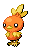
  
  
  
  
  
  
  
  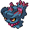
  
  
  
  
  
  
  

![Matplotlib](https://img.shields.io/badge/Matplotlib-%23285479.svg?logo=data:image/svg+xml;base64,PD94bWwgdmVyc2lvbj0iMS4wIiBlbmNvZGluZz0idXRmLTgiPz4KPHN2ZyB2aWV3Qm94PSIwIDAgNTAwIDUwMCIgeG1sbnM9Imh0dHA6Ly93d3cudzMub3JnLzIwMDAvc3ZnIj4KICA8ZGVmcy8+CiAgPHBhdGggZD0iTSAyNDUuMzExIDYuMjc4IEMgNTguMjggOS4yNTIgLTU1LjQwMSAyMTMuNzk3IDQwLjY4NCAzNzQuNDYzIEMgMTM2Ljc3NCA1MzUuMTMgMzcwLjU2MyA1MzEuNDE1IDQ2MS41MDcgMzY3Ljc3NiBDIDU1MC43OTMgMjA3LjEyNCA0MzYuNjQ0IDkuMTk3IDI1My4wMjQgNi4yNzggTCAyNDUuMzExIDYuMjc4IFogTSAyNDUuMzExIDYwLjMzNiBDIDk5Ljg1NSA2My4zMDggMTIuMTU4IDIyMi44MDIgODcuNDU5IDM0Ny40MjMgQyAxNjIuNzU5IDQ3Mi4wNDUgMzQ0LjU3OCA0NjguMzI3IDQxNC43MzcgMzQwLjczNSBDIDQ2My4zNTQgMjUyLjMxMiA0MzMuMDczIDE0OS42NSAzNjAuNjI3IDk2LjQ0MiBDIDMzMC45ODIgNzQuNjY4IDI5NC4yNzUgNjEuMTc4IDI1My4wMjQgNjAuMzM2IEwgMjQ1LjMxMSA2MC4zMzYgWiBNIDI0NS4zMTEgMTE0LjM5MyBDIDE0MS40MzMgMTE3LjM2NiA3OS43MjYgMjMxLjc5OCAxMzQuMjM2IDMyMC4zNjggQyAxODguNzQ0IDQwOC45NDEgMzE4LjU4OSA0MDUuMjI2IDM2Ny45NTkgMzEzLjY4IEMgNDE1LjcwOCAyMjUuMTMzIDM1My41MDMgMTE3LjI2NSAyNTMuMDI0IDExNC4zOTMgTCAyNDUuMzExIDExNC4zOTMgWiBNIDI0NS4zMTEgMTY4LjQ1MSBDIDE4My4wMzEgMTcxLjQyNCAxNDcuMzE5IDI0MC43NzYgMTgxLjAzIDI5My4yODUgQyAyMTQuNzQzIDM0NS43OTQgMjkyLjU5MyAzNDIuMDc5IDMyMS4xNjIgMjg2LjU5NiBDIDM0OC4xOCAyMzQuMTI2IDMxMS45MjQgMTcxLjI2MSAyNTMuMDI0IDE2OC40NTEgTCAyNDUuMzExIDE2OC40NTEgWiBNIDI0NS4zMTEgMjIyLjUwOCBDIDIyNC43NDEgMjI1LjQ4MSAyMTUuMDk4IDI0OS42MjkgMjI3Ljk1NCAyNjUuOTc4IEMgMjQwLjgwOSAyODIuMzI2IDI2Ni41MjQgMjc4LjYxMiAyNzQuMjM3IDI1OS4yOSBDIDI4MC43MjUgMjQzLjA0NSAyNzAuMzE5IDIyNS4wMDYgMjUzLjAyNCAyMjIuNTA4IEwgMjQ1LjMxMSAyMjIuNTA4IFogTSA0OTIuMTU5IDI0OS41MzcgTCA2LjE3NiAyNDkuNTM3IE0gNDIyLjczMiA3NS43OCBMIDc1LjYwMyA0MjMuMjkzIE0gNDIyLjczMiA0MjMuMjkzIEwgNzUuNjAzIDc1Ljc4IE0gMjQ5LjE2NyA2LjI3OCBMIDI0OS4xNjcgNDkyLjc5NSIgc3R5bGU9InBhaW50LW9yZGVyOiBzdHJva2UgbWFya2VyczsgZmlsbC1ydWxlOiBldmVub2RkOyBmaWxsOiByZ2IoMjU1LCAyNTUsIDI1NSk7IGZpbGwtb3BhY2l0eTogMDsgc3Ryb2tlLXdpZHRoOiAxMHB4OyBzdHJva2U6IHJnYigyNTUsIDI1NSwgMjU1KTsiLz4KICA8cGF0aCBkPSJNIDE5NS4xNjkgMzMuMzA3IEwgMTE4LjAzIDcxLjkyIEwgMzgwLjMwNSA0MjcuMTU0IEwgNDE4Ljg3NSAzODguNTQyIEwgMjQ5LjE2NyAyNDkuNTM3IEwgMTk1LjE2OSAzMy4zMDcgWiIgc3R5bGU9ImZpbGw6IHJnYigyNTUsIDI1NSwgMjU1KTsiLz4KICA8cGF0aCBkPSJNIDY3Ljg4OCAxOTUuNDggTCA2Ny44ODggMzAzLjU5NCBMIDI0OS4xNjcgMjQ5LjUzNyBMIDY3Ljg4OCAxOTUuNDggWiIgc3R5bGU9ImZpbGw6IHJnYigyNTUsIDI1NSwgMjU1KTsiLz4KICA8cGF0aCBkPSJNIDI0OS4xNjcgMjQ5LjUzNyBMIDI3Mi4zMDkgMzg0LjY4IEwgMjI2LjAyNSAzODQuNjggTCAyNDkuMTY3IDI0OS41MzcgWiIgc3R5bGU9ImZpbGw6IHJnYigyNTUsIDI1NSwgMjU1KTsiLz4KICA8cGF0aCBkPSJNIDI0OS4xNjcgMjQ5LjUzNyBMIDI5OS4zMDkgOTUuMDg2IEwgMzM0LjAyMSAxMTQuMzkzIEwgMjQ5LjE2NyAyNDkuNTM3IFoiIHN0eWxlPSJmaWxsOiByZ2IoMjU1LCAyNTUsIDI1NSk7Ii8+CiAgPHBhdGggZD0iTSAyNDkuMTY3IDI0OS41MzcgTCAzMDMuMTY1IDIyNi4zNjkgTCAzMDcuMDIyIDI0MS44MTQgTCAyNDkuMTY3IDI0OS41MzcgWiBNIDI0OS4xNjcgMjQ5LjUzNyBMIDE0OC44ODUgMjk5LjczMyBMIDE2MC40NTcgMzE1LjE3OCBMIDI0OS4xNjcgMjQ5LjUzNyBaIiBzdHlsZT0iZmlsbDogcmdiKDI1NSwgMjU1LCAyNTUpOyIvPgo8L3N2Zz4=&logoColor=white)
![Seaborn](https://img.shields.io/badge/Seaborn-%2388afbb.svg?logo=data:image/svg+xml;base64,PHN2ZyB4bWxucz0iaHR0cDovL3d3dy53My5vcmcvMjAwMC9zdmciIHZpZXdCb3g9IjAgMCA1MDAgNTAwIj48cGF0aCBkPSJNNiAyMDhjNy00NCAyNi04MiA1NC0xMTZBMjQyIDI0MiAwIDAgMSAyNzggNWEyMzkgMjM5IDAgMCAxIDE2MSA4NSAyNDggMjQ4IDAgMCAxIDU5IDE0OCAyNDYgMjQ2IDAgMCAxLTU2IDE2OGMtMjMgMjctNTEgNDgtODMgNjRBMjUxIDI1MSAwIDAgMSAyNyAzNTcgMjQ0IDI0NCAwIDAgMSA2IDIwOG0xNyAxMDNhMjM2IDIzNiAwIDAgMCAzNzcgMTE4Yzc3LTYxIDEwNi0xNjggNzAtMjU5QTIyNyAyMjcgMCAwIDAgMjc2IDE4IDIzMiAyMzIgMCAwIDAgMjMgMzEwWiIgZmlsbD0iI2ZmZiIgb3BhY2l0eT0iMSIvPjxwYXRoIGQ9Ik0yMyAzMTBBMjMzIDIzMyAwIDAgMSAyNzYgMThjOTUgMTIgMTYwIDYzIDE5NCAxNTEgMzYgOTEgNyAxOTgtNzAgMjYwQTIzNiAyMzYgMCAwIDEgMjMgMzEwbTQwNi0xODloMWwtMS0yLTEwLTEzYy02MC02NS0xMzUtOTAtMjIzLTcwQzEzNSA1MCA5MCA4NyA1NyAxNDBjLTcgMTItMTIgMjUtMTcgMzhsMiAyIDM1LTRjMjYtNiA1My05IDc3LTE5IDM1LTEzIDY5LTMwIDEwMy00NiA0NC0yMSA4OS0yNiAxMzYtNmwzNiAxNk0zNiAyODBsLTUgNCAxMCA0MiA1Mi0yM2MzNi0xNSA3My0xNiAxMDktMiAyMCA4IDM5IDE2IDU3IDI2IDUyIDI3IDEwNiA0NyAxNjUgNTEgNSAwIDgtMSAxMS01IDE4LTI4IDMwLTU4IDM1LTkwLTE3LTYtMzQtMTAtNTAtMTctMzEtMTMtNjEtMjgtOTItNDMtNTEtMjUtMTAzLTI2LTE1NCAwbC00MiAyMWMtMzEgMTUtNjIgMjktOTYgMzZtMTQyIDI2Yy00OS0xMC05MSA4LTEzMyAzMCAzOSA3OSAxMDAgMTI2IDE4OCAxMzMgNzYgNiAxMzgtMjIgMTg4LTc4LTI1LTUtNDktOS03My0xNi0zNy05LTcwLTI4LTEwNC00NGwtNjYtMjVtLTM0LTgwIDM1LTE3YzQ0LTIxIDg5LTI0IDEzNS0zbDUzIDI1YzI5IDE0IDU4IDI3IDg5IDM1bDE2IDRjMy00MS00LTc5LTIxLTExNS01LTEwLTExLTE4LTIyLTIybC0zMC0xNGMtNDAtMTctODAtMjEtMTIxLTRsLTY2IDMwYy01MyAyOC0xMTAgNDQtMTcwIDQ3LTUgMC03IDItOCA3bC02IDM3djM0YzQyLTggNzktMjYgMTE2LTQ0WiIgZmlsbD0idHJhbnNwYXJlbnQiIG9wYWNpdHk9IjEiLz48cGF0aCBkPSJNMzYgMjgwYzM0LTcgNjUtMjEgOTYtMzZsNDItMjFjNTEtMjYgMTAzLTI1IDE1NCAwIDMxIDE1IDYxIDMwIDkyIDQzIDE2IDcgMzMgMTEgNTAgMTctNSAzMi0xNyA2Mi0zNSA5MC0zIDQtNiA1LTExIDUtNTktNC0xMTMtMjQtMTY1LTUxLTE4LTEwLTM3LTE4LTU3LTI2LTM2LTE0LTczLTEzLTEwOSAybC01MiAyMy0xMC00MiA1LTRaIiBmaWxsPSIjZmZmIiBvcGFjaXR5PSIxIi8+PHBhdGggZD0ibTE3OSAzMDYgNjUgMjVjMzQgMTYgNjcgMzUgMTA0IDQ0IDI0IDcgNDggMTEgNzMgMTYtNTAgNTYtMTEyIDg0LTE4OCA3OC04OC03LTE0OS01NC0xODgtMTMzIDQyLTIyIDg0LTQwIDEzNC0zMFptLTM2LTgwYy0zNiAxOC03MyAzNi0xMTUgNDR2LTM0bDYtMzdjMS01IDMtNyA4LTcgNjAtMyAxMTctMTkgMTcwLTQ3bDY2LTMwYzQxLTE3IDgxLTEzIDEyMSA0bDMwIDE0YzExIDQgMTcgMTIgMjIgMjIgMTcgMzYgMjQgNzQgMjEgMTE1bC0xNi00Yy0zMS04LTYwLTIxLTg5LTM1bC01My0yNWMtNDYtMjEtOTEtMTgtMTM1IDNsLTM2IDE3WiIgZmlsbD0iI2ZmZiIgb3BhY2l0eT0iMSIvPjxwYXRoIGQ9Im00MjkgMTIwLTM2LTE1Yy00Ny0yMC05Mi0xNS0xMzYgNi0zNCAxNi02OCAzMy0xMDMgNDYtMjQgMTAtNTEgMTMtNzcgMTlsLTM1IDQtMi0yYzUtMTMgMTAtMjYgMTctMzggMzMtNTMgNzgtOTAgMTM5LTEwNCA4OC0yMCAxNjMgNSAyMjMgNzBsMTAgMTRaIiBmaWxsPSIjZmZmIiBvcGFjaXR5PSIxIi8+PHBhdGggZD0ibTQyOSAxMjAgMSAxaC0xdi0xWiIgZmlsbD0iI0IzRDZERSIgb3BhY2l0eT0iMSIvPjwvc3ZnPg==&logoColor=white)

This is a Data Science project, whose 3 main objectives are:
1. Generation of a dataset containing information about all Pokémons (until generation IX) including all variants and forms.
2. Preprocessing of that dataset, extraction of basic information and visualizations.
3. Apply Data Science Techniques in order to calculate higher level information and visualizations.

<h1>$${\color{royalblue}\textbf{Part 1: Dataset creation, web scraping}}$$  </h1>

To generate the Pokémon dataset, a web scraper has been programmed using Python, to get all the information required from [Bulbapedia](https://bulbapedia.bulbagarden.net/wiki/Main_Page). Information is extracted for every Pokémon and variation in the [List of Pokémon by National Pokédex Number](https://bulbapedia.bulbagarden.net/wiki/List_of_Pok%C3%A9mon_by_National_Pok%C3%A9dex_number) (so information for regional variations and alternate forms is extracted, not for Mega evolutions or Dynamax forms) The information is stored in a .csv file, in which, for each Pokémon and form in rows, the following information is extracted:
- **DexNumber**: Number of the National Pokédex for that Pokémon.
- **Name**: Name of the Pokémon.
- **Type**: Pokémon's typing as a list.
- **Abilities**: Pokémon's abilities as a list.
- **Generation**: The generation where it was introduced.
- **Hp**: Hp base stat.
- **Attack**: Attack base stat.
- **Defense**: Defense base stat.
- **SpecialAttack**: Special attack base stat.
- **SpecialDefense**: Special defense base stat.
- **Speed**: Speed base stat.
- **TotalStats**: Total stats (sum of the previous six stats).
- **Weight**: Weight in kg.
- **Height**: Height in m.
- **GenderProbM**: Probability of a Pokémon of that species being male (if it has unknown gender, it will be None).
- **Category**: Category of that Pokémon (some distinct Pokémons have the same categories, and it may vary between evolutions).
- **CatchRate**: Capture rate of that Pokémon.
- **EggCycles**: Number of cycles (steps, the number of steps in each cycle varies among games) to hatch an egg of that Pokémon.
- **EggGroup**: Egg Group(s) of that Pokémon.
- **LevelingRate**: Class of the XP growth of that Pokémon.
- **BaseFriendship**: Base friendship of that Pokémon.
- **IsLegendary**: Denotes if it is a legendary Pokémon.
- **IsLegendary**: Denotes if it is a legendary Pokémon.
- **IsMythical**: Denotes if it is a mythical Pokémon.
- **IsUltraBeast**: Denotes if it is an ultra beast.
- **HasMega**: Has a Mega evolution.
- **EvoStage**: Evolution Stage of that Pokémon.
- **TotalEvoStages**: Total evolution stages for that Pokémon.
- **PreevoName**: Name of the Preevolution (in case that Pokémon has one)
- **DamageFrom(Type)**: Amount of damage taken for a specific attack type.

Information about Pokémon moves is currently not extracted, but intended to in a further iteration of the project.

<h1>$${\color{gold}\textbf{Part 2: Preprocessing, analysis, visualizations}}$$  </h1>

In this second part of the project, further **cleaning and visualization** techniques are applied in order to deeply understand the dataset extracted from the internet. 2 Jupyter notebooks are used in this part: preprocess.ipynb and visualizationsEDA.ipynb.

<h2>$${\color{gold}\textbf{Limpieza de datos}}$$</h2>

In preprocess.ipynb, data preprocessing and initial **single feature statistics** is performed. Apart from that, some **attibutes** were divided into several ones in order to store **atomic information** (Type divided in Type1 and Type2, Abilities divided in Ability1, Ability2 and HiddenAbility, EggGroup divided into EggGroup1 and EggGroup2, or the creation of an additional feature named NoGender indicates wether the Pokémon has Gender or not, which complements GenderProb feature).

Se crearon **dos conjuntos de datos preprocesados**, uno preparado para realizar **visualizaciones** (siguiente apartado en esta parte) y otro para aplicar técnicas de **aprendizaje automático** que se usará en la parte 3.

<h2>$${\color{gold}\textbf{Visualizaciones de datos}}$$</h2>

In visualizationsEDA.ipynb, containing advanced visualizations, we can extract some impacting conclusions.

<h3>$${\color{orange}\textbf{Información sobre tipos}}$$</h3>

La información sobre tipos es muy interesante y nos permite hacer muchas visualizaciones que nos den datos curiosos

    

En este diagrama de cuerdas se puede ver las "relaciones entre tipos" entendiendo una relación entre tipos cuando un Pokémon tiene 2 tipos. Así, habrá tipos que estén más relacionados entre sí (normal y volador) y otros que estén menos relacioados (eléctrico y hada) u otros que ni siquiera están relacionados (bicho y dragón).

      
       

En estos gráficos podemos ver, por un lado, la cantidad de Pokémons de cada tipo que han ido saliendo en cada generación (en la sexta hay una gran inflación de Pokémon de tipo hada no porque el tipo se introdujera en esta generación, sino porque se tiene en cuenta todas las formas de Flabébé, Floette y Florges). Cada Pokémon cuenta como 1 luego si un Pokémon tiene dos tipos suma 0.5 a cada tipo en el gráfico. Se puede ver también aquí qué generación introdujo más Pokémon y cuál menos claramente (5ª y 6ª respectivamente). El segundo gráfico es un gráfico muy informativo sobre qué tipo es mejor ofensivamente hablando, no sólo teniendo en cuenta la tabla de tipos, sino también cual sería el multiplicador de daño a cada Pokémon en particular de todos los que hay, haciendo una kernel density estimation, así como un valor medio del multiplicador, viendo que el mejor tipo ofensivameante hablando en promedio es el tipo roca con un valor medio de multiplicador de daño de x1.22, y el menos efectivo es el normal, con un x0.86 (normal porque no es superefectivo a ningún tipo pero tiene resistencias e inmunidades). 

     
     

Este último gráficos podemos ver dos aspectos relevantes, el primero responde a la pregunta ¿Hay tipos "más fuertes que otros"?, cuya respuesta es que sí, en general las estadísticas medias (cada rectángulo es una estadística, de abajo a arriba, Hp, Attack, Defense, SpecialAttack, SpecialDefense, Speed) del tipo acero son mayores que las del tipo hielo. El tipo más fuerte en promedio es el dragón y el más débil es el bicho, lo cual tiene sentido puesto que hay muchos Pokémon legendarios y pseudolegendarios de tipo dragón, mientras que hay muchos Pokémons muy débiles de rutas iniciales de tipo bicho. Además se muestran de forma más detallada estos valores medios por estadística, lo cual nos lleva al siguiente punto de visualización:

<h3>$${\color{orange}\textbf{Estadísticas de los Pokémon}}$$</h3>

Para ello se han llevado análisis, en primer lugar se ha hecho un análisis completo de distribución bidimensional de estadísticas ofensivas (ataque y velocidad) (ataque especial y velocidad) y defensivas (hp y defensa) (hp y defensa especial) de los Pokémon, incluyendo zonas de alta densidad y visualizaciones que incluyen los minisprites de Pokémon para más claridad (para verlas de manera interactiva, entrar en el cuaderno)

     
     

    
     

Estos gráficos son extremadamente llamativos, puesto que podemos ver los Pokémon que destacan o que están en la media en términos defensivos y ofensivos. Además incluyen histogramas marginales para que se pueda ver la distribución de cada estadística individualmente.

Además de ello, se ha hecho un ranking de los mejores Pokémon en función de cada estadística:

- **Top 5 highest Hp Pokémon**: 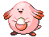  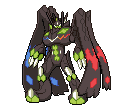 

  Blissey: 255, Chansey: 250, Guzzlord: 223, Zygarde Complete: 216, Regidrago: 200.
- **Top 5 highest Attack Pokémon**:    

  Kartana: 181, Deoxys Attack: 180, Kyurem Black: 170, Necrozma Dawn Wings and Dusk Mane: 167.
- **Top 5 highest Defense Pokémon**:   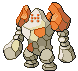 

  Shuckle: 230, Stakataka: 211, Regirock and Steelix: 200, Hisuian Avalugg: 184 (tied with Avalugg).
- **Top 5 highest Spe.Attack Pokémon**: 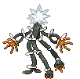   

  Deoxys Attack: 180, Xurkitree: 173, Hoopa Unbound and Kyurem White: 170, Necrozma Dawn Wings (tied with Dusk Mane): 167.
- **Top 5 highest Spe.Defense Pokémon**:    

  Shuckle: 230, Regice: 200, Deoxys Defense: 160, Florges and Lugia: 154 (tied with Ho-Oh).
- **Top 5 highest Speed Pokémon**:  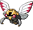 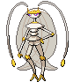 

  Regieleki: 200, Deoxys Speed: 180, Ninjask: 160, Pheromosa: 151, Calyrex Shadow Rider: 150 (tied with Deoxys Attack, Deoxys, Electrode and Hisuian Electrode.

But only one stat is not usually enough for a Pokémon to be good or viable, if it is bad in any other stat. That is the reason why we will consider the geometric mean of pair of related statistics in order to get the best sweepers (attack x speed and spe.attack x speed) and walls (hp x defense and hp x special defense) Pokémon: 

- **Top 5 physical sweepers Pokémons**:  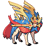  

  $\sqrt{\text{Attack}\cdot \text{Speed}}$: Deoxys Attack: 164.3168, Deoxys: 150, Zacian Crowned Sword: 148.9966, Galarian Darmanitan Zen Mode: 146.9693, Necrozma Dusk Mane (tied with Dawn Wings): 146.7753.
- **Top 5 special sweepers Pokémons**:      

  $\sqrt{\text{Spe.Attack}\cdot \text{Speed}}$: Deoxys Attack: 164.3168, Calyrex Shadow Rider: 157.3213 (tied with Ice Rider), Deoxys: 150, Necrozma Dawn Wings (tied with Dusk Mane): 146.7753
- **Top 5 physical walls Pokémons**:   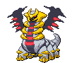 

  $\sqrt{\text{Hp}\cdot \text{Defense}}$: Zygarde Complete: 161.6663, Ting-Lu: 139.1941, Melmetal: 138.9424, Giratina: 134.1641, Avalugg: 132.2120 (tied with Hisuian Avalugg).
- **Top 5 special walls Pokémons**:    

  $\sqrt{\text{Hp}\cdot \text{Spe.Defense}}$: Blissey: 185.5398, Chansey: 162.0185, Zygarde Complete: 143.2480, Giratina: 134.1641, Snorlax: 132.6650.

<h3>$${\color{orange}\textbf{Información de habilidades}}$$</h3>

He decidido también extraer información sobre habilidades, en este caso sobre la frecuencia de las mismas. Se han hecho histogramas sobre habilidades más comúnes y menos comunes, así como extraído alguna información llamativa:

    
     

- **Most common abilities**: Sturdy (46 Pokémon), Swift Swim (45 Pokémon), Keen Eye (41 Pokémon), Levitate (39 Pokémon), Intimidate (39 Pokémon)
- **Examples of Pokémon with unique abilities**:    

  (Silvally: RKS System, Dhelmise: Steelworker, Golisopod: Emergency Exit, Stonjourner: Power Spot, Zangoose: Toxic Boost)
- **Most common abilities in evolution lines**: Levitate (in 30 evolution lines), Pressure (in 27 evolution lines), Sturdy (in 26 evolution lines), Swift Swim (in 25 evolution lines), Run Away (in 25 evolution lines).
- **Examples of evolution lines with unique abilities**: 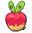 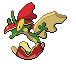      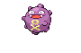    

  (Applin: Ripen, Skitty: Normalize, Fletchling: Gale Wings, Koffing: Neutralizing Gas, Silicobra: Sand Spit)

<h3>$${\color{orange}\textbf{Relación entre grupos huevo}}$$</h3>

Se ha hecho un diagrama de cuerdas como el primero sobre tipos también para grupos huevo (información sobre cómo los Pokémons se pueden reproducir) en función de los Pokémons que comparten grupo huevo:

    

<h3>$${\color{orange}\textbf{Diagramas de sectores}}$$</h3>

Veamos ahora algunos diagramas de sectores conteniendo información sobre algunos atributos de Pokémon curiosos:

    
     

    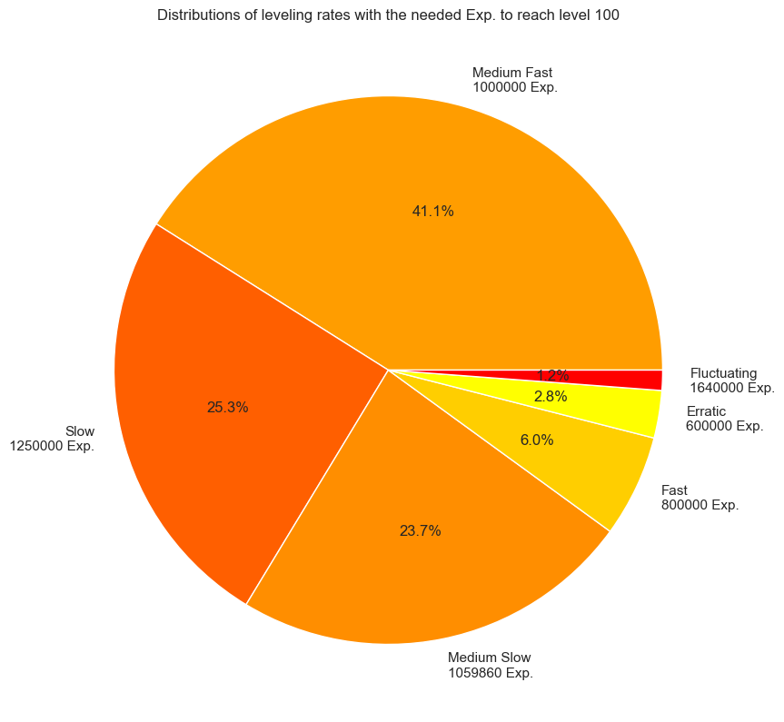
    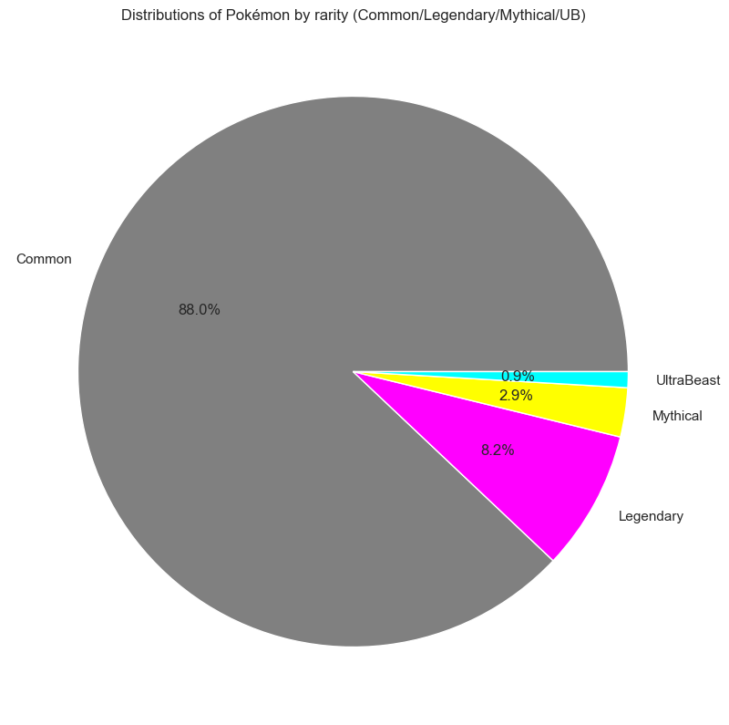 

<h3>$${\color{orange}\textbf{Reducción de dimensionalidad}}$$</h3>

Por último me gustaría terminar con una visualización de todo el conjunto de datos 

    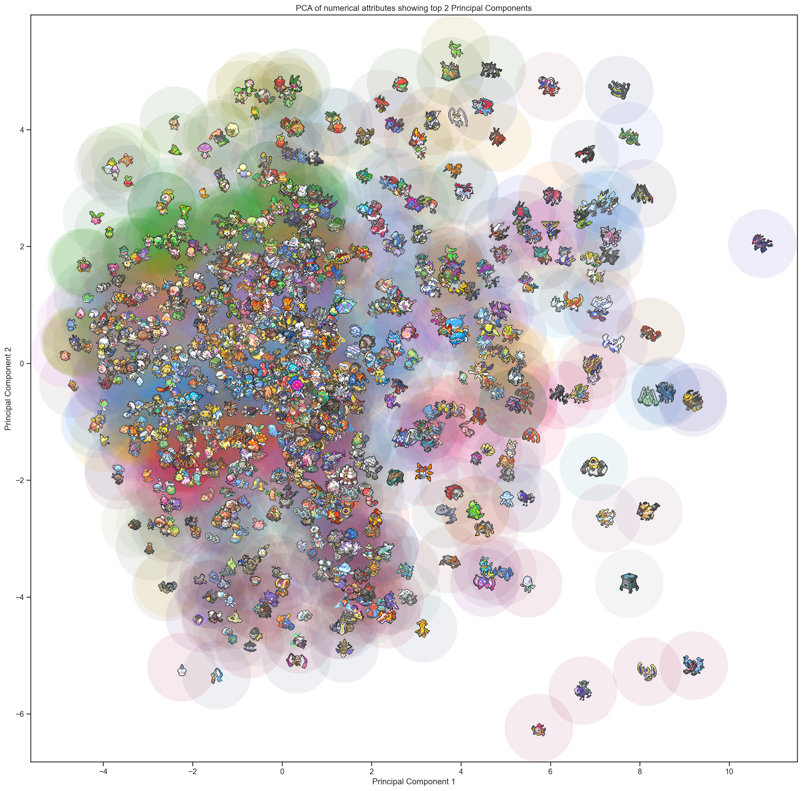 

<h1>$${\color{red}\textbf{Part 3: Machine Learning, AI, CV}}$$  </h1>

En esta última parte del proyecto, utilizando el dataset obtenido y procesándolo para la correcta aplicación de técnicas de inteligencia artificial, (sólo se han considerado atributos numéricos, por ejemplo se ha descartado información sobre habilidades) y se han realizado una serie de preguntas para las cuales se ha obtenido respuesta mediante su aplicación. Las preguntas han sido las siguientes: ¿Se puede...

<h2>$${\color{crimson}\textbf{Predecir si un Pokémon es Legendario?}}$$</h2>

Para ello se ha utilizado un conjunto de clasificadores (**DecisionTreeClassifier , RandomForestClassifier, GradientBoostingClassifier, AdaBoostClassifier, LightGBM**) con el objetivo de predecirlo. Puesto que el conjunto de datos es **desbalanceado** (91.77% no legendarios, 8.23% legendarios) en lugar de utilizar técnicas de downsampling o upsampling, se ha decidido utilizar métricas que tengan en cuenta dicho desbalanceo y que sirvan para guiar a los clasificadores. Éstas son:

- **Matthews Correlation Coefficient (MCC)**, which is a good metric for these cases of unbalance. $$MCC = \frac{TP \cdot TN - FP \cdot FN}{\sqrt{(TP + FP)(TP + FN)(TN + FP)(TN + FN)}}$$ This metric ranges from -1 (totally incorrect classification) to 1 (perfect prediction), being a value of 0 a prediction no better than random prediction.

- **Area under Precision-Recall Curve (PR-AUC)**, considers both precision and recall, being these: $$\text{Precision =} \frac{TP}{TP+FP},\ \text{Recall =} \frac{TP}{TP+FN} $$ Precision and recall are usually inversely related (not always necesarily. Recall is monotonically increasing with an increasing classification threshold, but precision not always decreases), and we will study the area under the curve of both metrics varying the classification threshold.

Utilizando estas métricas y un total de 20 semillas distintas para partición training-test, se han calculado resultados de validación para dichos modelos utilizando un KFold cross validation de 10 folds, los cuales han servido para ponderar pesos de un **clasificador ensemble** utilizando todos los modelos anteriores. Con todos estos modelos hemos obtenido los resultados de test, y los promedios han sido:

|        | DecisionTree | RandomForest | GradientBoosting | AdaBoost | LightGBM | EnsembleModel |
|:------:|:------------:|:------------:|:----------------:|:--------:|:--------:|:-------------:|
|   **MCC**  |    0.88301   |    0.89351   |      0.94704     |  0.89696 |  0.94557 |    0.96252    |
| **PR-AUC** |    0.90107   |    0.97087   |      0.97567     |  0.96252 |  0.98308 |    0.98620    |

Por lo que el clasificador **ensemble ha sido el que mejor resultado ha obtenido**, haciendo una clasificación con **métricas casi perfectas**.

De igual manera se ha hecho para predecir si un Pokémon es mítico, con los siguientes resultados:

|        | DecisionTree | RandomForest | GradientBoosting | AdaBoost | LightGBM | EnsembleModel |
|:------:|:------------:|:------------:|:----------------:|:--------:|:--------:|:-------------:|
|   **MCC**  |    0.76962   |    0.73779   |      0.89320     |  0.87060 |  0.88605 |    0.89786    |
| **PR-AUC** |    0.79357   |    0.94953   |      0.95229     |  0.93086 |  0.95058 |    0.95475    |

La cual ha sido una tarea **más difícil pero con resultados igualmente buenos**.

Y para predecir si es Ultraente o no:

|        | DecisionTree | RandomForest | GradientBoosting | AdaBoost | LightGBM | EnsembleModel |
|:------:|:------------:|:------------:|:----------------:|:--------:|:--------:|:-------------:|
|   **MCC**  |    0.56900   |    0.00000   |      0.73477     |  0.92040 |  1.00000 |    1.00000    |
| **PR-AUC** |    0.73481   |    1.00000   |      0.85000     |  1.00000 |  1.00000 |    1.00000    |

Vemos que este último caso es más extremo, pero se consigue una **clasificación perfecta** (sin utilizar ninguna información sobre habilidades u otros predictores directos).

<h2>$${\color{crimson}\textbf{Predecir su exp. a nivel 100?}}$$</h2>

En este caso se ha considerado un problema de **regresión** (inicialmente clasificación ordinaria pero se decidió pasar a regresión por utilizar un paradigma distinto, aunque se plantea volver a clasificación ordinaria si el tiempo me lo permite) en el que se plantea **predecir la cantidad de experiencia que necesita un Pokémon para subir a nivel 100** (asociado a LevelingRate).

La métrica que se ha utilizado en este caso es el **error cuadrático medio (RMSE)**. Los clasificadores que se han decidido emplear han sido **LinearRegression, DecisionTreeRegressor, RandomForestRegressor, GradientBoostingRegressor, AdaBoostRegressor** y de nuevo se ha considerado un **modelo ensemble** de la misma manera que en el apartado anterior, teniendo en cuenta que RMSE es una métrica que cuanto más baja sea, mejor.

Los resultados obtenidos han sido los siguientes (normalizando el atributo a predecir al rango [0,1], siendo 0 la experiencia mínima 600k, y 1 la experiencia máxima 1.64M:

|        | LinearRegression | DecisionTree | RandomForest | GradientBoosting | AdaBoost | EnsembleModel |
|:------:|:----------------:|:------------:|:------------:|:----------------:|:--------:|:-------------:|
|   **RMSE**  |    0.12295   |    0.15491   |      0.10239     |  0.10990 |  0.15054 |    0.11290    |

En general la **predicción es bastante buena** de igual manera, y en este caso no ha ganado el modelo ensemble, sino RandomForestRegression.

<h2>$${\color{crimson}\textbf{Encontrar grupos de Pokémon similares?}}$$</h2>

Nos preguntamos si se pueden **agrupar a los Pokémon de manera automática** en grupos similares en función de sus características, de manera que estén lo más agrupados posible dentro de su grupo y lo más separados posible con respecto al resto de los grupos. Para ello utilizaremos técnicas de **aprendizaje no supervisado**, en este caso usaremos **clústering jerárquico** para encontrar dichos grupos. El resultado lo **visualizaremos** con una técnica de **reducción de dimensionalidad** llamada t-SNE (t-distributed Stochastic Neighbor Embedding). Se eligió realizar un total de 16 grupos, los cuales se muestran a continuación:

    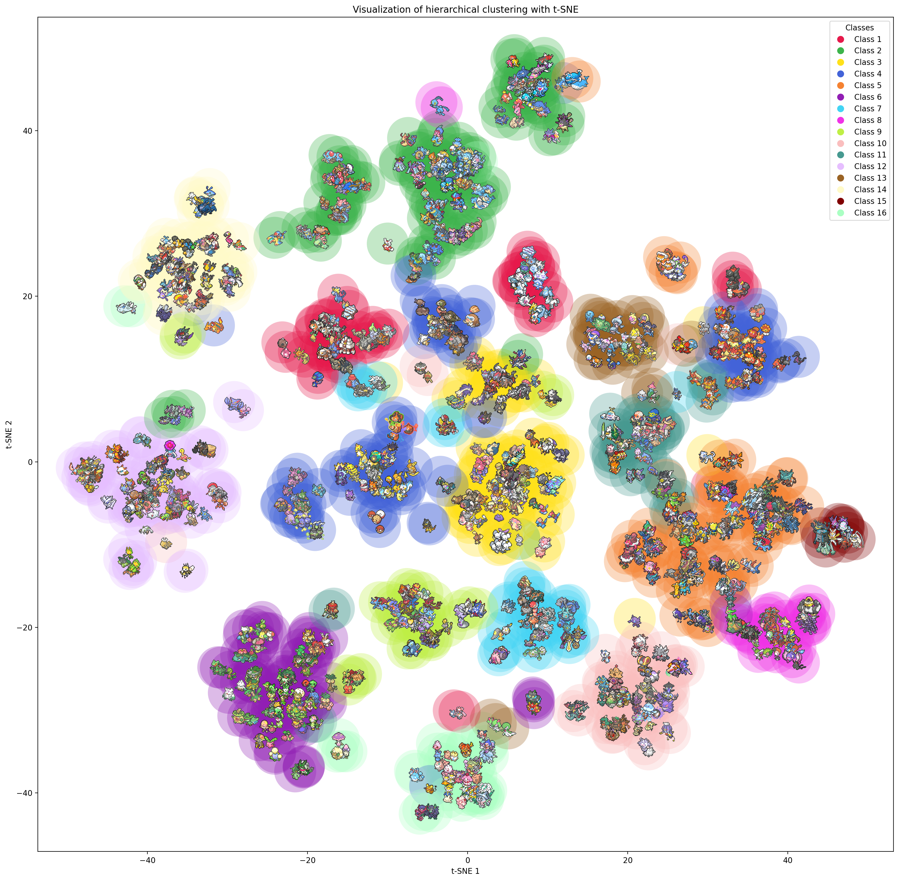

Visualizando los grupos encontrados, se puede ver que corresponden a las siguientes características:
- **Class 1**: Ice- and Rock-type Pokémon.
- **Class 2**: Water-type and fossil Pokémon.
- **Class 3**: Normal-type Pokémon.
- **Class 4**: Fire-, Ground-, Electric- and Poison-type Pokémon.
- **Class 5**: Legendary and Paradox Pokémon.
- **Class 6**: Grass-type Pokémon.
- **Class 7**: Steel-type Pokémon.
- **Class 8**: Other Legendary and Mythical Pokémon.
- **Class 9**: Dragon-type Pokémon.
- **Class 10**: Ghost-type Pokémon.
- **Class 11**: Fighting-type Pokémon.
- **Class 12**: Bug-type Pokémon.
- **Class 13**: Psychic-type Pokémon.
- **Class 14**: Flying-type Pokémon.
- **Class 15**: Ultrabeasts.
- **Class 16**: Fairy-type Pokémon.

Es muy interesante ver cómo hay tipos de Pokémon que tienen su propia clase diferenciada de las demás (tipo planta, bicho o dragón) además de ver qué Pokémons con dos tipos caen en cada una (Togekiss en hada, Hydrapple en dragón). La clase 4 aglutina muchos tipos, y los Pokémon Legendarios están divididos en dos clases diferenciadas. Además hay excepciones como Drapion, que es más parecido a los Pokémon de la clase 2 (por eso está allí) que a los de la clase 4. Este gráfico tiene muchas conclusiones interesantes, y ahí van sólo algunas de ellas. 

<h2>$${\color{crimson}\textbf{Saber el tipo primario de un Pokémon sólo viéndolo?}}$$</h2>

Esta es una tarea de **Visión por Computador**. El problema es por tanto un problema de **clasificación multiclase** donde hay **18 clases** posibles. Para ello, y como los minisprites eran muy pequeños, se ha decidido utilizar los sprites de 5ª generación (sin animar en este caso) de los Pokémon.

    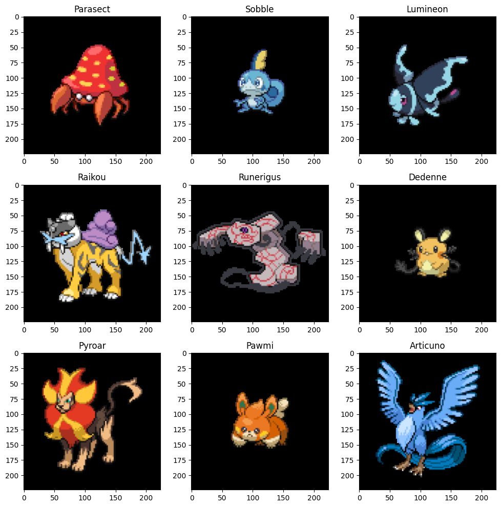

 Como métrica de pérdida se ha usado la **categorical crossentropy**. Se han utilizado diferentes modelos en **keras** como **extractores de características** (**DenseNet121, Xception**) y después se ha entrenado una **red densa** con dichas características de 500, 200 y 18, neuronas. Además se han aplicado técnicas de **data augmentation** mediante traslaciones, rotaciones o flips horizontales y **normalización de imágenes**, así como un **peso** a las imágenes en función de su clase, pues el problema es desbalanceado (descartado, pues funcionaba mejor sin pesos), así como capas de **regularización** para evitar sobreajuste (Dropout y BatchNormalization, así como L2 kernel regularization), así como **early stopping** restaurando los mejores pesos encontrados. Además de ello, posteriormente se ha hecho **fine tuning** con las últimas capas de DenseNet, y como última técnica se ha probado a añadir a los modelos **histogramas de color en formato HSV**, pues se entiende que el tipo estará correlacionado con el color de los Pokémon.
 
 Por último, la división de los datos ha sido 80%-20% en training test y un 10% de los datos de training para validación. Los resultados han sido los siguientes:

|          | DenseNetFeatExt | XceptionFeatExt | DenseNetFineTuning | DenseNetFeatExt+Hist |
|:--------:|:---------------:|:---------------:|:------------------:|:--------------------:|
| **Accuracy** |     0.33050     |     0.22457     |       0.30932      |        0.30508       |

Curiosamente el mejor resultado en test lo ha dado DenseNet con extracción de características. Puede parecer un accuracy en test bastante bajo, pero hay que tener en cuenta que hay 18 clases, y que un predictor aleatorio en caso de que las clases estuvieran balanceadas tendría un accuracy de aproximadamente 1/18 aprox. 0.05, luego podemos afirmar que **nuestros modelos han aprendido a identificar patrones y a clasificar, aunque queda un gran margen de mejora**. Además, viendo las curvas de aprendizaje del mejor modelo:

    
    

Podemos ver que se produce realmente sobreajuste, con lo que se poría seguir ahondando en por qué ocurre.

|      | Bug | Dark | Dragon | Electric | Fairy | Fighting | Fire | Flying | Ghost | Grass | Ground | Ice | Normal | Poison | Psychic | Rock | Steel | Water |
|:----:|:---:|:----:|:------:|:--------:|:-----:|:--------:|:----:|:------:|:-----:|:-----:|:------:|:---:|:------:|:------:|:-------:|:----:|:-----:|:-----:|
| **Bug**     | $${\color{green} 3}$$  | $${\color{black} 0}$$  | $${\color{black} 0}$$  | $${\color{red} 1}$$  | $${\color{black} 0}$$  | $${\color{black} 0}$$  | $${\color{red} 2}$$  | $${\color{black} 0}$$  | $${\color{red} 1}$$  | $${\color{red} 1}$$  | $${\color{red} 1}$$  | $${\color{red} 1}$$  | $${\color{red} 2}$$  | $${\color{black} 0}$$  | $${\color{red} 1}$$  | $${\color{red} 1}$$  | $${\color{black} 0}$$  | $${\color{red} 4}$$  |
| **Dark**     | $${\color{black} 0}$$  | $${\color{green} 1}$$  | $${\color{red} 1}$$  | $${\color{black} 0}$$  | $${\color{black} 0}$$  | $${\color{black} 0}$$  | $${\color{red} 2}$$  | $${\color{black} 0}$$  | $${\color{black} 0}$$  | $${\color{red} 0}$$  | $${\color{red} 0}$$  | $${\color{red} 4}$$  | $${\color{red} 0}$$  | $${\color{black} 0}$$  | $${\color{red} 0}$$  | $${\color{red} 0}$$  | $${\color{black} 0}$$  | $${\color{red} 3}$$  |
| **Dragon**     | $${\color{black} 0}$$  | $${\color{black} 0}$$  | $${\color{green} 1}$$  | $${\color{black} 0}$$  | $${\color{black} 0}$$  | $${\color{black} 0}$$  | $${\color{black} 0}$$  | $${\color{black} 0}$$  | $${\color{black} 0}$$  | $${\color{black} 0}$$  | $${\color{black} 0}$$  | $${\color{red} 1}$$  | $${\color{black} 0}$$  | $${\color{black} 0}$$  | $${\color{black} 0}$$  | $${\color{red} 1}$$  | $${\color{red} 2}$$  | $${\color{red} 4}$$  |
| **Electric**     | $${\color{black} 0}$$  | $${\color{black} 0}$$  | $${\color{black} 0}$$  | $${\color{green} 1}$$  | $${\color{black} 0}$$  | $${\color{black} 0}$$  | $${\color{black} 0}$$  | $${\color{black} 0}$$  | $${\color{black} 0}$$  | $${\color{black} 0}$$  | $${\color{black} 0}$$  | $${\color{red} 10}$$  | $${\color{black} 0}$$  | $${\color{black} 0}$$  | $${\color{black} 0}$$  | $${\color{black} 0}$$  | $${\color{black} 0}$$  | $${\color{red} 3}$$  |
| **Fairy**     | $${\color{black} 0}$$  | $${\color{black} 0}$$  | $${\color{black} 0}$$  | $${\color{red} 1}$$  | $${\color{green} 4}$$  | $${\color{black} 0}$$  | $${\color{black} 0}$$  | $${\color{black} 0}$$  | $${\color{black} 0}$$  | $${\color{red} 1}$$  | $${\color{black} 0}$$  | $${\color{black} 0}$$  | $${\color{red} 2}$$  | $${\color{black} 0}$$  | $${\color{reblackd} 0}$$  | $${\color{black} 0}$$  | $${\color{black} 0}$$  | $${\color{red} 1}$$  |
| **Fighting**     | $${\color{black} 0}$$  | $${\color{black} 0}$$  | $${\color{red} 1}$$  | $${\color{black} 0}$$  | $${\color{red} 1}$$  | $${\color{green} 0}$$  | $${\color{black} 0}$$  | $${\color{black} 0}$$  | $${\color{black} 0}$$  | $${\color{black} 0}$$  | $${\color{black} 0}$$  | $${\color{black} 0}$$  | $${\color{red} 3}$$  | $${\color{black} 0}$$  | $${\color{black} 0}$$  | $${\color{black} 0}$$  | $${\color{red} 1}$$  | $${\color{red} 3}$$  |
| **Fire**     | $${\color{black} 0}$$  | $${\color{red} 1}$$  | $${\color{black} 0}$$  | $${\color{red} 2}$$  | $${\color{black} 0}$$  | $${\color{black} 0}$$  | $${\color{green} 7}$$  | $${\color{black} 0}$$  | $${\color{black} 0}$$  | $${\color{black} 0}$$  | $${\color{black} 0}$$  | $${\color{black} 0}$$  | $${\color{red} 5}$$  | $${\color{black} 0}$$  | $${\color{black} 0}$$  | $${\color{black} 0}$$  | $${\color{black} 0}$$  | $${\color{black} 0}$$  |
| **Flying**     | $${\color{black} 0}$$  | $${\color{black} 0}$$  | $${\color{red} 1}$$  | $${\color{black} 0}$$  | $${\color{black} 0}$$  | $${\color{black} 0}$$  | $${\color{black} 0}$$  | $${\color{green} 0}$$  | $${\color{black} 0}$$  | $${\color{black} 0}$$  | $${\color{black} 0}$$  | $${\color{red} 1}$$  | $${\color{black} 0}$$  | $${\color{black} 0}$$  | $${\color{black} 0}$$  | $${\color{black} 0}$$  | $${\color{black} 0}$$  | $${\color{black} 0}$$  |
| **Ghost**     | $${\color{black} 0}$$  | $${\color{red} 1}$$  | $${\color{black} 0}$$  | $${\color{black} 0}$$  | $${\color{black} 0}$$  | $${\color{red} 1}$$  | $${\color{black} 0}$$  | $${\color{black} 0}$$  | $${\color{green} 3}$$  | $${\color{black} 0}$$  | $${\color{black} 0}$$  | $${\color{red} 1}$$  | $${\color{red} 2}$$  | $${\color{black} 0}$$  | $${\color{rblacked} 0}$$  | $${\color{black} 0}$$  | $${\color{black} 0}$$  | $${\color{red} 0}$$  |
| **Grass**     | $${\color{black} 0}$$  | $${\color{black} 0}$$  | $${\color{black} 0}$$  | $${\color{black} 0}$$  | $${\color{black} 0}$$  | $${\color{black} 0}$$  | $${\color{black} 0}$$  | $${\color{black} 0}$$  | $${\color{black} 0}$$  | $${\color{green} 12}$$  | $${\color{black} 0}$$  | $${\color{black} 0}$$  | $${\color{red} 6}$$  | $${\color{black} 0}$$  | $${\color{black} 0}$$  | $${\color{red} 1}$$  | $${\color{red} 2}$$  | $${\color{red} 1}$$  |
| **Ground**     | $${\color{black} 0}$$  | $${\color{black} 0}$$  | $${\color{red} 1}$$  | $${\color{black} 0}$$  | $${\color{black} 0}$$  | $${\color{black} 0}$$  | $${\color{black} 0}$$  | $${\color{black} 0}$$  | $${\color{red} 1}$$  | $${\color{black} 0}$$  | $${\color{green} 3}$$  | $${\color{black} 0}$$  | $${\color{red} 3}$$  | $${\color{black} 0}$$  | $${\color{black} 0}$$  | $${\color{black} 0}$$  | $${\color{black} 0}$$  | $${\color{red} 1}$$  |
| **Ice**     | $${\color{red} 1}$$  | $${\color{black} 0}$$  | $${\color{black} 0}$$  | $${\color{black} 0}$$  | $${\color{black} 0}$$  | $${\color{black} 0}$$  | $${\color{black} 0}$$  | $${\color{black} 0}$$  | $${\color{black} 0}$$  | $${\color{black} 0}$$  | $${\color{black} 0}$$  | $${\color{green} 2}$$  | $${\color{red} 2}$$  | $${\color{black} 0}$$  | $${\color{black} 0}$$  | $${\color{black} 0}$$  | $${\color{black} 0}$$  | $${\color{red} 3}$$  |
| **Normal**     | $${\color{black} 0}$$  | $${\color{red} 1}$$  | $${\color{black} 0}$$  | $${\color{black} 0}$$  | $${\color{black} 0}$$  | $${\color{black} 0}$$  | $${\color{red} 2}$$  | $${\color{black} 0}$$  | $${\color{red} 1}$$  | $${\color{black} 0}$$  | $${\color{red} 1}$$  | $${\color{black} 0}$$  | $${\color{green} 18}$$  | $${\color{black} 0}$$  | $${\color{black} 0}$$  | $${\color{red} 2}$$  | $${\color{black} 0}$$  | $${\color{red} 2}$$  |
| **Poison**     | $${\color{black} 0}$$  | $${\color{black} 0}$$  | $${\color{black} 0}$$  | $${\color{black} 0}$$  | $${\color{black} 0}$$  | $${\color{red} 1}$$  | $${\color{red} 1}$$  | $${\color{black} 0}$$  | $${\color{black} 0}$$  | $${\color{red} 1}$$  | $${\color{black} 0}$$  | $${\color{red} 1}$$  | $${\color{red} 1}$$  | $${\color{green} 1}$$  | $${\color{black} 0}$$  | $${\color{black} 0}$$  | $${\color{black} 0}$$  | $${\color{red} 4}$$  |
| **Psychic**     | $${\color{black} 0}$$  | $${\color{black} 0}$$  | $${\color{black} 0}$$  | $${\color{red} 1}$$  | $${\color{black} 0}$$  | $${\color{black} 0}$$  | $${\color{black} 0}$$  | $${\color{red} 1}$$  | $${\color{black} 0}$$  | $${\color{red} 1}$$  | $${\color{black} 0}$$  | $${\color{black} 0}$$  | $${\color{red} 3}$$  | $${\color{black} 0}$$  | $${\color{green} 1}$$  | $${\color{black} 0}$$  | $${\color{black} 0}$$  | $${\color{red} 8}$$  |
| **Rock**     | $${\color{black} 0}$$  | $${\color{red} 1}$$  | $${\color{black} 0}$$  | $${\color{black} 0}$$  | $${\color{black} 0}$$  | $${\color{red} 1}$$  | $${\color{red} 1}$$  | $${\color{black} 0}$$  | $${\color{black} 0}$$  | $${\color{black} 0}$$  | $${\color{red} 1}$$  | $${\color{black} 0}$$  | $${\color{red} 2}$$  | $${\color{black} 0}$$  | $${\color{black} 0}$$  | $${\color{green} 5}$$  | $${\color{black} 0}$$  | $${\color{red} 2}$$  |
| **Steel**     | $${\color{black} 0}$$  | $${\color{black} 0}$$  | $${\color{black} 0}$$  | $${\color{red} 1}$$  | $${\color{black} 0}$$  | $${\color{black} 0}$$  | $${\color{black} 0}$$  | $${\color{black} 0}$$  | $${\color{red} 1}$$  | $${\color{black} 0}$$  | $${\color{black} 0}$$  | $${\color{black} 0}$$  | $${\color{red} 1}$$  | $${\color{black} 0}$$  | $${\color{black} 0}$$  | $${\color{red} 2}$$  | $${\color{green} 2}$$  | $${\color{red} 1}$$  |
| **Water**     | $${\color{black} 0}$$  | $${\color{red} 2}$$  | $${\color{black} 0}$$  | $${\color{red} 2}$$  | $${\color{black} 0}$$  | $${\color{black} 0}$$  | $${\color{black} 0}$$  | $${\color{black} 0}$$  | $${\color{black} 0}$$  | $${\color{red} 1}$$  | $${\color{black} 0}$$  | $${\color{black} 0}$$  | $${\color{red} 8}$$  | $${\color{red} 1}$$  | $${\color{black} 0}$$  | $${\color{red} 1}$$  | $${\color{black} 0}$$  | $${\color{green} 14}$$  |

Como podemos ver hay algunas clases cuya mayoría de ejemplos han sido bien clasificados como lo puede ser Water, Normal o Grass, mientras que hay otras en las que la clasificación no se produce tan bien, pero es claro que el proceso de aprendizaje ha funcionado.

## Credits
**Author: David Villar Martos** (https://github.com/Daalma7)

Todas las imágenes de Pokémons extraídas para realizar este estudio fuero extraídas de las siguientes fuentes:
- Showdown (https://play.pokemonshowdown.com/sprites/)
- Pokémon Sprite Project (https://www.smogon.com/forums/threads/smogon-sprite-project.3647722/)
- Pacck de sprites de Pokémon estilo pixelart animados (https://www.youtube.com/watch?v=ltk8qxSpKlU)
- Generation 9 Resource Pack [v21.1] (https://www.pokecommunity.com/threads/generation-9-resource-pack-v21-1.527398/)
